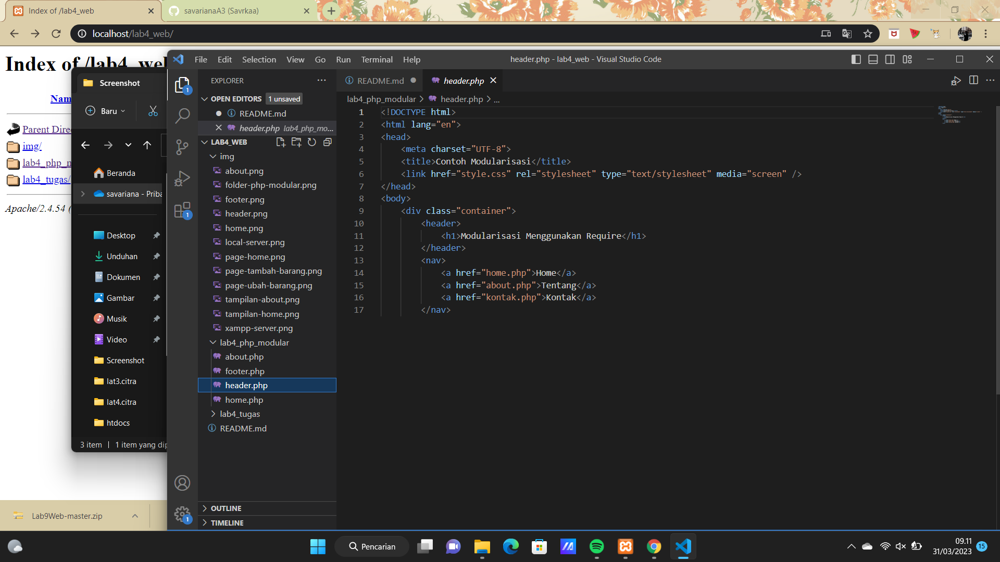
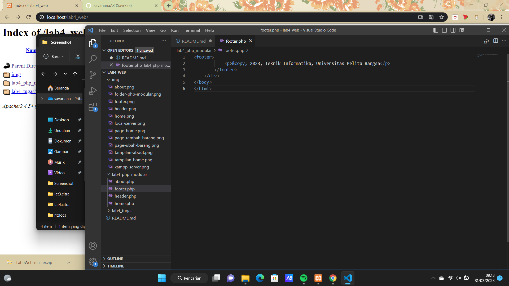

| SAVARIANA RIKA        | 312110052         |
|----------------------|--------------------|
|  TI.21.A3          |  PEMROGRAMAN WEB 2  |
|  PERTEMUAN  5      | PRAKTIKUM 3        |

## PERTEMUAN 5

## LAB 4 WEB

## PRAKTIKUM 3

Dipertemuan kali ini kita akan mempelajari **php modular** 

## LANGKAH - LANGKAH PRAKTIKUM

## 1). MENJALANKAN XAMPP SERVER


**PENJELASAN**

Menjalankan xampp server localhost

## 2).BUAT FOLDER BARU DENGAN NAMA **lab9_php_modular** 


**PENJELASAN**

Kemudian jalanlan pada localhost server dengan mengakses URL: http://localhost/lab4_web/


## 3). BUAT FILE BARU DENGAN NAMA **header.php**


**PENJELASAN**

Buat header seperti contoh di atas
 
 **code header**
 ```html
<!DOCTYPE html>
<html lang="en">
<head>
    <meta charset="UTF-8">
    <title>Contoh Modularisasi</title>
    <link href="style.css" rel="stylesheet" type="text/stylesheet" media="screen" />
</head>
<body>
    <div class="container">
        <header>
            <h1>Modularisasi Menggunakan Require</h1>
        </header>
        <nav>
            <a href="home.php">Home</a>
            <a href="about.php">Tentang</a>
            <a href="kontak.php">Kontak</a>
        </nav>
 ```

## 4). BUAT FILE BARU DENGAN NAMA **footer.php**


**PENJELASAN**

Buat **footer.php** dan code nya

**code footer**
```html
<footer>
            <p>&copy; 2023, Teknik Informatika, Universitas Pelita Bangsa</p>
        </footer>
    </div>
</body>
</html>
```

## 5). BUAT FILE BARU DENGAN NAMA **home.php**


**PENJELASAN**

Buat **home.php** dan code nya

**code home**
```php
<?php require('header.php'); ?>

<div class="content">
    <h2>Ini Halaman Home</h2>
    <p>Ini adalah bagian content dari halaman.</p>
</div>

<?php require('footer.php'); ?>
```

## 6). BUAT FILE BARU DENGAN NAMA **about.php**


**PENJELASAN**

Buat **about.php** dan code nya

**code about**
```php
<?php require('header.php'); ?>

<div class="content">
    <h2>Ini Halaman About</h2>
    <p>Ini adalah bagian content dari halaman.</p>
</div>

<?php require('footer.php'); ?>
```

## 7). TAMPILAN DIBROWSER YA

* Tampilan **home** page pada browser yang menggunakan modular ***header*** dan ***footer***


* Tampilan **about** page pada browser yang menggunakan modular ***header*** dan ***footer***


--------------------------------------------------------------------------------

## PERTANYAAN DAN TUGAS

* Implementasikan konsep modularisasi pada kode program **praktikum 3** tentang database, sehingga setiap halamannya template tampilan yang sama.

## 1) BUAT FOLDER BARU **lab4_tugas**

**PENJELASAN**

Buat file baru atau salin file pada **praktikum 3** lalu implementasikan dengan menambahkan modular **header** dan **footer**

## HASIL

* Tampilan pada bagian **Home** 


* Tampilan pada bagian **Tambah Barang**


* Tampilan pada bagian **Ubah Barang**


## PERTEMUAN KALI INI MEMBUAT PRAKTIKUM 3 

## THANKYOU,AND GOODBYE!

## @SAVARIANARIKA
